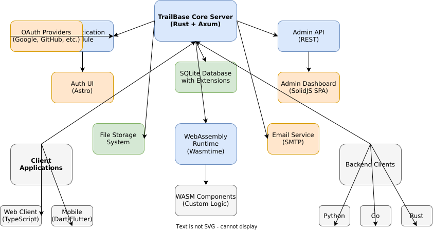
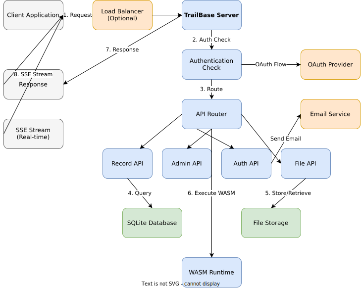

<p align="center">
  <a href="https://trailbase.io" target="_blank">
    <picture>
      
    </picture>
  </a>
</p>

<h1 align="center">TrailBase</h1>

<p align="center">
  <a href="https://github.com/trailbaseio/trailbase/stargazers/">
    
  </a>
  <a href="https://github.com/trailbaseio/trailbase/actions?query=branch%3Amain">
    
  </a>
  <a href="https://github.com/trailbaseio/trailbase/blob/main/LICENSE">
    
  </a>
  <a href="https://trailbase.io/reference/roadmap/">
    
  </a>
  <a href="https://crates.io/crates/trailbase">
    
  </a>
  <a href="https://www.npmjs.com/package/trailbase">
    
  </a>
</p>

<p align="center">
  <strong>An open, <a href="https://trailbase.io/reference/benchmarks/">blazingly fast</a>, single-executable Firebase alternative</strong>
</p>

<p align="center">
  Simplify with fewer moving parts: an easy to self-host, single-executable,
  extensible backend for your mobile, web or desktop application.
  Sub-millisecond latencies eliminate the need for dedicated caches, no more
  stale or inconsistent data.
</p>

<p align="center">
  Built on Rust, SQLite & Wasmtime with type-safe REST & realtime APIs,
  built-in WebAssembly runtime, SSR, auth and admin UI.
</p>

> **Note**: This repository contains enhanced documentation and development tools for TrailBase. The original project is available at [trailbaseio/trailbase](https://github.com/trailbaseio/trailbase).

## ✨ Features

- **🚀 Single Binary Deployment** - Everything compiled into one executable with embedded assets
- **⚡ Sub-millisecond Latencies** - SQLite-powered with optimized query execution
- **🔒 Built-in Authentication** - JWT-based auth with OAuth 2.0 providers (Google, GitHub, Apple, etc.)
- **📊 Auto-generated APIs** - Type-safe REST APIs automatically generated from database schemas
- **🔄 Real-time Subscriptions** - Server-sent events for live data updates
- **🎛️ Admin Dashboard** - Web-based admin interface for database management
- **🧩 WebAssembly Runtime** - Extensible backend using Wasmtime for custom logic
- **📁 File Management** - Built-in file upload and storage system
- **🌐 Multi-language Clients** - TypeScript, Rust, Python, Go, Swift, C#, Kotlin, Dart
- **📧 Email Integration** - Transactional email support for authentication flows

## 🏗️ Architecture



TrailBase follows a modular architecture built around a high-performance Rust core:

- **Core Server** (`crates/core/`) - HTTP server using Axum, SQLite database, authentication, and admin APIs
- **Admin Dashboard** (`crates/assets/js/admin/`) - SolidJS-based SPA for database management
- **Auth UI** (`crates/auth-ui/`) - Astro-based authentication interface
- **WebAssembly Runtime** - Wasmtime-based execution environment for custom components
- **Client Libraries** - Type-safe clients in 8+ programming languages

### Data Flow



The typical request flow through TrailBase:

1. **Client Request** - HTTP request from any client application
2. **Authentication** - JWT validation and OAuth provider integration
3. **API Routing** - Request routing to appropriate API handler
4. **Business Logic** - Core API processing with optional WASM execution
5. **Data Layer** - SQLite database operations and file storage
6. **Response** - JSON response or SSE stream for real-time updates

## 🚀 Quick Start

### Prerequisites

- Rust 1.90.0+ (for building from source)
- Node.js and pnpm (for UI development)
- Protobuf compiler (protoc)

### Installation

#### Option 1: Pre-built Binary (Recommended)

```bash
# Linux & macOS
curl -sSL https://trailbase.io/install.sh | bash

# Windows
iwr https://trailbase.io/install.ps1 | iex
```

#### Option 2: Docker

```bash
# Create data directory
mkdir -p traildepot

# Run TrailBase
docker run \
  -p 4000:4000 \
  -e ADDRESS=0.0.0.0:4000 \
  --mount type=bind,source="$PWD"/traildepot,target=/app/traildepot \
  trailbase/trailbase /app/trail
```

#### Option 3: Build from Source

```bash
# Clone the repository
git clone --recursive https://github.com/trailbaseio/trailbase.git
cd trailbase

# Install dependencies
pnpm install
git submodule update --init --recursive

# Build the binary
cargo build --bin trail --release

# Run the server
./target/release/trail run
```

### Basic Usage

```bash
# Start the server
trail run

# Start in development mode (permissive CORS)
trail run --dev

# Add authentication UI
trail components add trailbase/auth_ui

# Generate API schema
trail schema users --mode select

# Generate OpenAPI specification
trail openapi print > openapi.json
```

### First Steps

1. **Start TrailBase**: `trail run`
2. **Access Admin UI**: Open http://localhost:4000/_/admin
3. **Default Credentials**: Check terminal output for auto-generated admin credentials
4. **Create Tables**: Use the admin UI or SQL migrations
5. **Generate APIs**: APIs are automatically created from your tables
6. **Connect Clients**: Use any of the supported client libraries

## 📖 Documentation

### API Reference

TrailBase automatically generates REST APIs from your database tables. For example:

```bash
# List all records
GET /api/v1/records/users

# Create a new record
POST /api/v1/records/users
{
  "name": "John Doe",
  "email": "john@example.com"
}

# Real-time subscriptions
GET /api/v1/records/users?subscribe=true
```

### Configuration

| Variable | Description | Default |
|----------|-------------|---------|
| `ADDRESS` | Server bind address | `127.0.0.1:4000` |
| `DATA_DIR` | Runtime data directory | `./traildepot` |
| `JWT_SECRET` | JWT signing secret | Auto-generated |
| `LOG_LEVEL` | Logging level | `info` |
| `CORS_ORIGINS` | Allowed CORS origins | `*` in dev mode |

### Database Migrations

```bash
# Create a new migration
trail migrate create create_users_table

# Run migrations
trail migrate up

# Check migration status
trail migrate status
```

## 🧪 Testing

```bash
# Run all tests
cargo test

# Run specific package tests
cargo test --package trailbase-core
cargo test --package trailbase-client

# Run frontend tests
cd crates/assets/js/admin && pnpm run test

# Run full project check
make check
```

## 💻 Client Libraries

### TypeScript/JavaScript

```bash
npm install trailbase
```

```typescript
import { TrailBaseClient } from 'trailbase';

const client = new TrailBaseClient('http://localhost:4000');
const users = await client.list('users');
```

### Rust

```bash
cargo add trailbase-client
```

```rust
use trailbase_client::TrailBaseClient;

let client = TrailBaseClient::new("http://localhost:4000")?;
let users = client.list("users").await?;
```

### Python

```bash
pip install trailbase
```

```python
from trailbase import TrailBaseClient

client = TrailBaseClient('http://localhost:4000')
users = client.list('users')
```

For other languages, see the [client documentation](https://trailbase.io/reference/clients/).

## 🔧 Development

### Setting up Development Environment

```bash
# Install Rust
curl --proto '=https' --tlsv1.2 -sSf https://sh.rustup.rs | sh

# Install pnpm
curl -fsSL https://get.pnpm.io/install.sh | sh

# Clone with submodules
git clone --recursive https://github.com/trailbaseio/trailbase.git
cd trailbase

# Install dependencies
pnpm install
git submodule update --init --recursive
```

### Development Workflow

```bash
# Start server in development mode
cargo run -- --data-dir client/testfixture run --dev

# Admin UI development
cd crates/assets/js/admin
pnpm run dev

# Format all code
make format

# Check all code
make check

# Build release binary
make static
```

## 🤝 Contributing

Contributions are welcome! Please see [CONTRIBUTING.md](CONTRIBUTING.md) for guidelines.

1. Fork the repository
2. Create a feature branch (`git checkout -b feature/amazing-feature`)
3. Commit changes (`git commit -m 'Add amazing feature'`)
4. Push to branch (`git push origin feature/amazing-feature`)
5. Open a Pull Request

### Development Guidelines

- Follow the existing code style (enforced by `make format`)
- Add tests for new functionality
- Update documentation as needed
- Ensure all checks pass (`make check`)

## 📄 License

TrailBase is free software under the terms of the [Open Software License 3.0 (OSL-3.0)](LICENSE).

The OSL-3.0 is a copyleft license with a narrower definition of "derivative work" that only covers modifications to TrailBase itself. This means your application's original code is not subject to the OSL-3.0's copyleft provisions when using TrailBase.

## 🙏 Acknowledgments

This project is based on [TrailBase](https://github.com/trailbaseio/trailbase) by the TrailBase team.

**Original Project**: https://github.com/trailbaseio/trailbase

TrailBase is an open-source project originally created and maintained by the TrailBase team. This repository contains enhancements to the documentation and development tooling.

**Core Technologies Used**:
- **SQLite** - For the incredible embedded database engine
- **Axum** - For the ergonomic web framework
- **Wasmtime** - For the WebAssembly runtime
- **SolidJS** - For the reactive admin UI framework
- **Astro** - For the authentication UI framework

Special thanks to:
- The TrailBase team for creating this amazing backend-as-a-service solution
- All contributors to the original TrailBase project
- The open-source community for the tools and libraries that make TrailBase possible

## 🔗 Links

- [Website](https://trailbase.io)
- [Documentation](https://trailbase.io/reference/)
- [Demo](https://demo.trailbase.io/_/admin) (Email: `admin@localhost`, Password: `secret`)
- [FAQ](https://trailbase.io/reference/faq/)
- [Discord Community](https://discord.gg/trailbase)
- [Twitter/X](https://twitter.com/trailbaseio)

---

<p align="center">
  <strong>If you like TrailBase or want to follow along, consider leaving a ⭐🙏</strong>
</p>